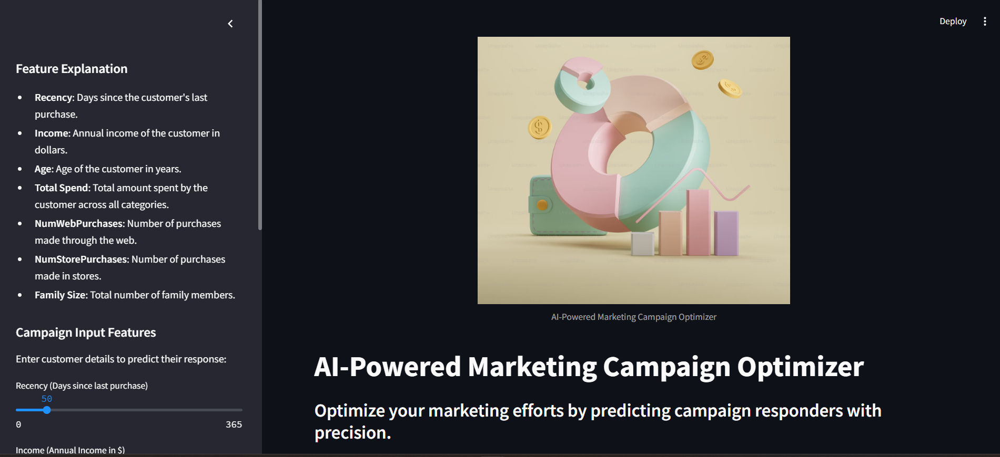
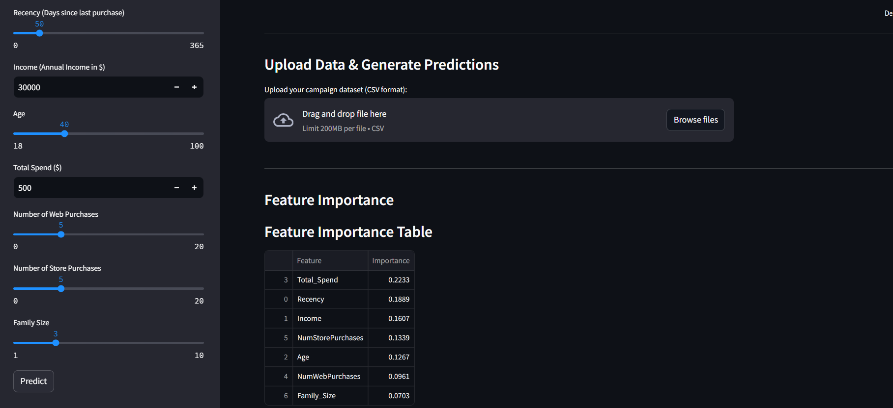
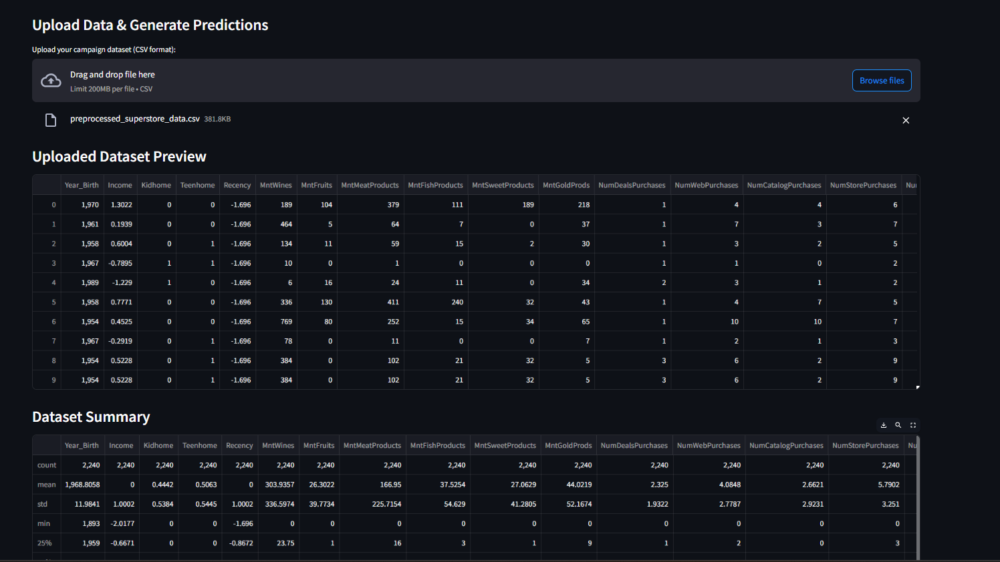
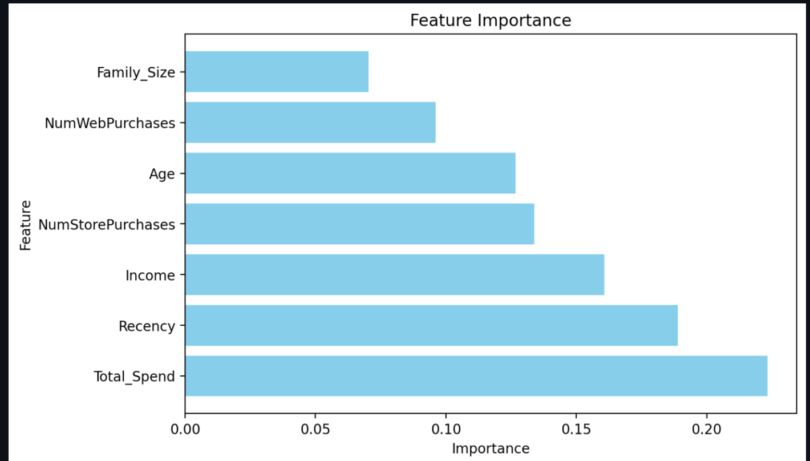

# **AI-Powered Marketing Campaign Optimizer**

The **AI-Powered Marketing Campaign Optimizer** is a web application built using **Streamlit**. It leverages **machine learning** to analyze customer data and predict campaign responders, empowering businesses to make data-driven marketing decisions. The project includes bulk and single-customer prediction modes, feature importance visualization, and an intuitive interface for easy usability.

---

## **Table of Contents**
- [Overview](#overview)
- [Features](#features)
- [Technologies Used](#technologies-used)
- [How It Works](#how-it-works)
- [Installation](#installation)
- [Usage](#usage)
- [Project Structure](#project-structure)
- [Screenshots](#screenshots)
- [Future Enhancements](#future-enhancements)
- [Contributing](#contributing)


---

## **Overview**
Marketing campaigns often require extensive analysis to determine which customers are most likely to respond. This project addresses that challenge by:
- Predicting campaign responders using a machine learning model.
- Providing insights into the most influential factors driving customer decisions.
- Offering an easy-to-use interface for marketers and data analysts.

The app is designed to work with any structured customer data and generate actionable insights quickly.

---

## **Features**
1. **Bulk Predictions**:
   - Upload customer datasets in CSV format.
   - Predict campaign responses for multiple customers.
   - View predictions with confidence scores.

2. **Single-Customer Prediction**:
   - Input individual customer details.
   - Get real-time predictions with confidence scores.

3. **Feature Importance Visualization**:
   - Understand the most critical features influencing predictions.

4. **Data Insights**:
   - Summarize uploaded datasets with descriptive statistics.
   - Preview data in an easy-to-read format.

5. **Downloadable Predictions**:
   - Export the prediction results as a CSV file for further analysis.

---

## **Technologies Used**
- **Programming Language**: Python
- **Framework**: Streamlit (for web interface)
- **Machine Learning**: Scikit-learn (for training and predictions)
- **Visualization**: Matplotlib (for feature importance graphs)
- **Data Handling**: Pandas (for dataset manipulation)

---

## **How It Works**
1. **Data Upload**:
   - Users upload a customer dataset in CSV format containing features like `Income`, `Recency`, `Age`, and others.

2. **Model Predictions**:
   - The application uses a pre-trained machine learning model to predict whether customers will respond to the campaign.
   - Predictions are accompanied by confidence scores.

3. **Insights**:
   - Feature importance visualizations provide insights into what drives campaign success.
   - Descriptive statistics summarize the dataset.

4. **Interactive Single Prediction**:
   - Users can manually input customer details to get individual predictions instantly.

---

## **Installation**
Follow these steps to set up and run the project locally:

1. Clone the repository:
   ```bash
   git clone https://github.com/<your-username>/AI-Marketing-Optimizer.git
   cd AI-Marketing-Optimizer
   

2.Set up a virtual environment:

   ```bash
   python -m venv env
   source env/bin/activate  # On Windows: env\Scripts\activate
   ```

3.Install dependencies:
  ```bash
  pip install -r requirements.txt
 ```
4. Run the application:
  ```bash
 streamlit run app.py
 ```
## Usage

Once the project is set up, you can either upload a dataset for bulk predictions or use the sidebar to make single predictions.

<h3>1. Bulk Predictions</h3>
<ol>
  <li>Upload a campaign dataset (CSV format) through the <strong>Upload Data & Generate Predictions</strong> section on the main page.</li>
  <li>The app will:
    <ul>
      <li>Display a preview of the uploaded dataset.</li>
      <li>Show a summary of the dataset statistics.</li>
      <li>Generate predictions and confidence scores for each entry in the dataset.</li>
      <li>Provide a bar chart summarizing the predictions.</li>
    </ul>
  </li>
</ol>

<h3>2. Single Prediction</h3>
<ol>
  <li>Use the <strong>Campaign Input Features</strong> section in the sidebar.</li>
  <li>Enter the following inputs:
    <ul>
      <li><strong>Recency</strong>: Days since the customer's last purchase.</li>
      <li><strong>Income</strong>: Annual income of the customer in dollars.</li>
      <li><strong>Age</strong>: Age of the customer in years.</li>
      <li><strong>Total Spend</strong>: Total amount spent by the customer across all categories.</li>
      <li><strong>NumWebPurchases</strong>: Number of purchases made through the web.</li>
      <li><strong>NumStorePurchases</strong>: Number of purchases made in stores.</li>
      <li><strong>Family Size</strong>: Total number of family members.</li>
    </ul>
  </li>
  <li>Click the <strong>Predict</strong> button to generate the results.</li>
  <li>The app will display:
    <ul>
      <li><strong>Predicted Response</strong>: Responder or Non-Responder.</li>
      <li><strong>Confidence Levels</strong>: For both responder and non-responder predictions.</li>
    </ul>
  </li>
</ol>

<h3>3. Feature Importance</h3>
<ul>
  <li>The <strong>Feature Importance</strong> section provides:
    <ul>
      <li>A table listing the importance of each feature used in the model.</li>
      <li>A horizontal bar chart visualizing feature importance.</li>
    </ul>
  </li>
</ul>

<h2>Project Structure</h2>
<p>The project repository is organized as follows:</p>
<pre>
├── assets/               <!-- Contains static files like banners or logos -->
├── data/                 <!-- Stores datasets used for predictions -->
├── models/               <!-- Stores trained models and related artifacts -->
├── scripts/              <!-- Contains Python scripts for preprocessing and training -->
│   ├── preprocess.py     <!-- Data preprocessing script -->
│   ├── train_models.py   <!-- Model training script -->
├── app.py                <!-- Streamlit app file -->
├── requirements.txt      <!-- List of dependencies for the project -->
├── README.md             <!-- Detailed information about the project -->
</pre>
<h2>Screenshots</h2>
<p>Below are some screenshots of the application in action:</p>
<ul>
  <li><strong>Home Page:</strong></li>
  
  <li><strong>Single Prediction Section:</strong></li>
  
  <li><strong>Dataset Upload and Predictions:</strong></li>
  
  <li><strong>Feature Importance:</strong></li>
  
</ul>

<h2>Future Enhancements</h2>
<p>The following enhancements can be made to improve the project further:</p>
<ul>
  <li><strong>Model Improvements:</strong> Experiment with advanced machine learning models such as XGBoost or LightGBM for improved prediction accuracy.</li>
  <li><strong>Hyperparameter Tuning:</strong> Implement automated hyperparameter tuning using tools like Optuna or GridSearchCV.</li>
  <li><strong>Real-Time Data Integration:</strong> Add support for real-time data streaming using APIs for live predictions.</li>
  <li><strong>User Authentication:</strong> Implement a secure login system to restrict access to the application.</li>
  <li><strong>Enhanced Visualizations:</strong> Introduce more advanced visualizations, such as heatmaps and correlation matrices, to provide deeper insights into the data.</li>
  <li><strong>Multilingual Support:</strong> Add language options for a global user base.</li>
  <li><strong>Mobile Optimization:</strong> Make the application responsive for mobile users.</li>
</ul>
<h2>Contributing</h2>
<p>I welcome contributions to improve the project. To contribute, follow these steps:</p>
<ol>
  <li>Fork the repository.</li>
  <li>Create a new branch for your feature or bug fix:
    <pre><code>git checkout -b feature-name</code></pre>
  </li>
  <li>Make your changes and commit them:
    <pre><code>git commit -m "Description of changes"</code></pre>
  </li>
  <li>Push the changes to your branch:
    <pre><code>git push origin feature-name</code></pre>
  </li>
  <li>Submit a pull request to the <strong>main</strong> branch of this repository.</li>
</ol>


<h2>Contact</h2>
<p>For any questions, suggestions, or issues, please contact:</p>
<ul>
  <li><strong>Name</strong>: Rahul Lotlikar</li>
  <li><strong>Email</strong>: rahulujv@buffalo.edu</li>
  <li><strong>GitHub</strong>: <a href="https://github.com/rahul0776">https://github.com/rahul0776</a></li>
</ul>


